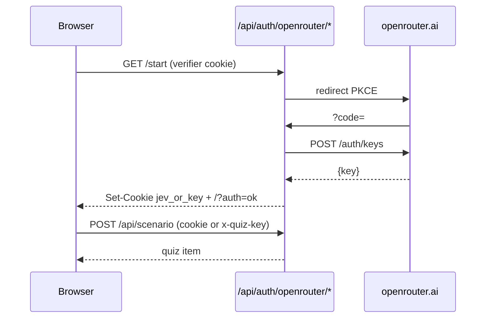

# Jev Trainer

Interactive quiz for the **dock manager's rule** — `menu` · `glance` · `branch` → `fast_lane` / `decompose` / `office`.

Focus: learning when a decision is **not** Jev-able as one call, and how to **decompose** it into sub-judgments that each pass all three dials.

## Run

```bash
cd ~/personal/jev-trainer
# public mode (default): no server key — each visitor BYOK or OpenRouter sign-in
# local-only host key:
#   QUIZ_ALLOW_SERVER_KEY=1 + GROQ_API_KEY (or QUIZ_BASE_URL + QUIZ_API_KEY + QUIZ_MODEL)
pnpm dev
```

Open http://localhost:3000

Works offline on a hand-authored seed bank; **new (llm)** pulls unlimited generated scenarios (AI SDK `generateObject` via the visitor's key). Generation failures fall back to seed.

## Keys (BYOK + OAuth)

Public by default — **host never spends its own key**. Resolution:

1. **Browser BYOK** — paste key in the **AI** settings: Groq · OpenRouter · **OpenAI** · **Anthropic** · custom OpenAI-compatible (header `x-quiz-key` + base + model). Stored in `localStorage` only; write-only UI, never re-displayed. OpenAI/Anthropic = API keys only — no consumer ChatGPT/Claude OAuth (ToS + native-client bound; agents do PKCE/loopback because they *are* the CLI).
2. **OpenRouter OAuth (PKCE)** — **Sign in** → `openrouter.ai/auth` → callback exchanges one-time code for `sk-or-…` → httpOnly cookie (`jev_or_key`). Log out clears it. No client secret (OpenRouter’s headless PKCE flow). One key → GPT + Claude models.
3. **Local host key** — only if `QUIZ_ALLOW_SERVER_KEY=1` (dev convenience; never set on a public deploy).



Status endpoint `GET /api/provider/status` returns booleans only (`hasKey`, host, model) — raw keys never leave storage.

## How to play

1. Read the scenario.
2. Toggle each dial: pass / fail (tap to flip).
3. Pick a verdict. The **rule preview** shows what your dials imply — if it disagrees with your pick, that's a signal before you check.
4. Check → per-dial truths + explanations.
5. If verdict is `decompose` and you got it: pick the split that restores the menu.

### Modes

| mode | practice |
|---|---|
| `mixed` | weighted mix |
| `fast_lane` | clean 3/3 only |
| `decompose` | menu-fail drills (the point of this app) |
| `office` | glance/branch fails |

## Rule (strict order)

```
glance FAIL → office
menu   FAIL → decompose
branch FAIL → office
else        → fast_lane
```

Ground-truth verdict is always recomputed from dials via `dockRule` server-side.

## Stack

- Next.js 16 (App Router) · React 19 · Tailwind 4
- AI SDK 7 `generateObject` + Zod
- `@ai-sdk/openai-compatible` → Groq (default) / any OpenAI-compatible base
